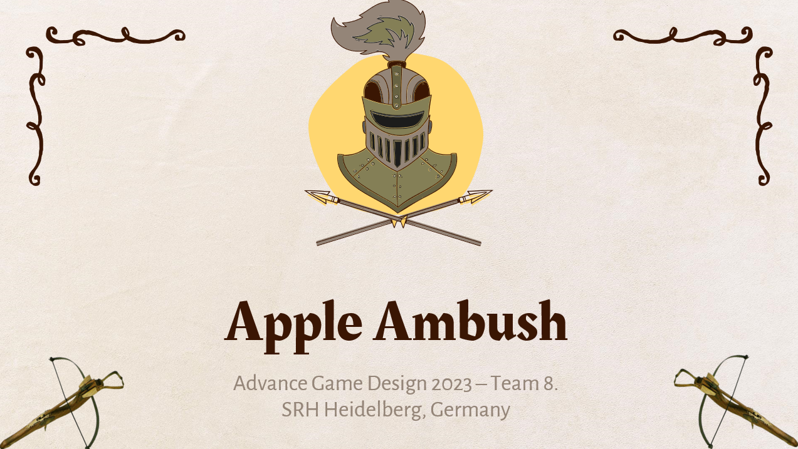
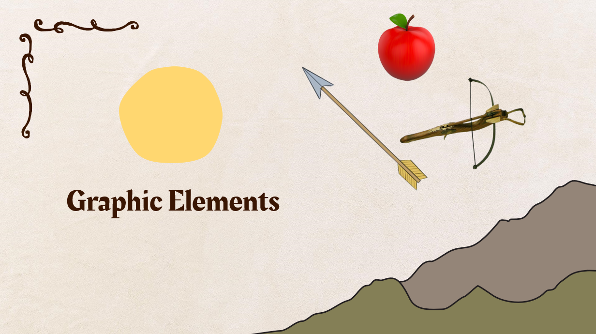
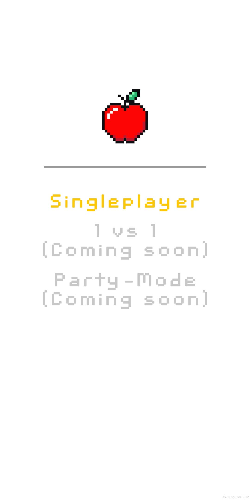
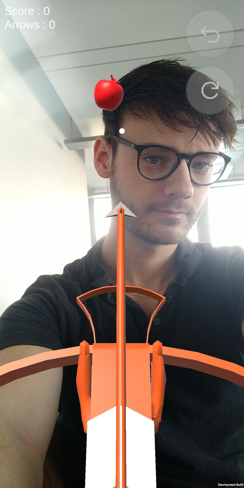
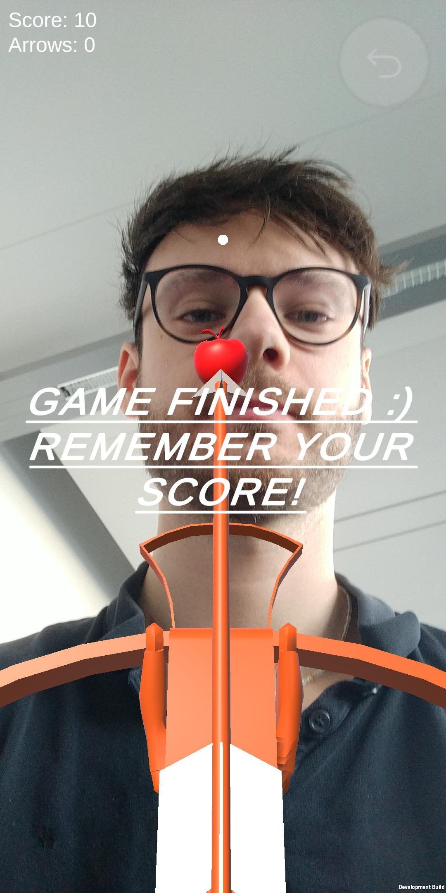

# Apple Ambush

This game is student-project by a student group. famously known as Team 8. Apple Ambush is a Unity project that uses ARFoundation to create a Wilhelm Tell inspired AR game where players are tasked to shoot apples off of people's heads.

## Releases

We have a .apk file released in versioned tags under the "Releases" section.

## Core graphic elements

The most core graphic elements are the crossbow, the arrow and the apple.

## Screenshots

||||
|-|-|-|
||||

## Contribution

Feel free to use this base-game as you like. I also accept pull requests.
